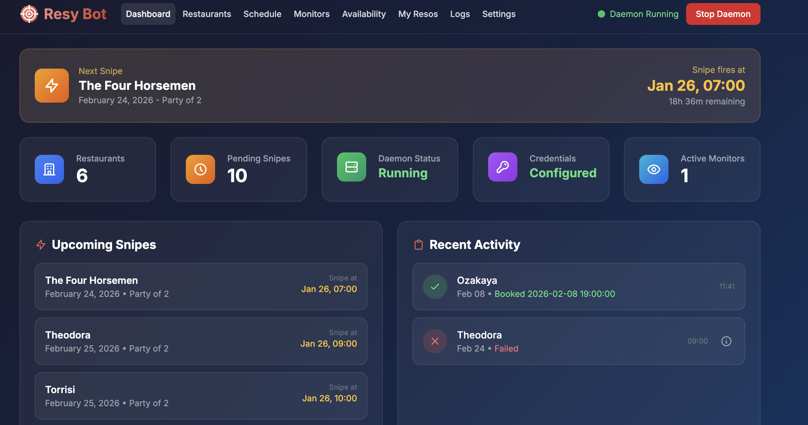

# Resy Bot

A reservation sniper for [Resy](https://resy.com) that helps you book hard-to-get restaurant reservations.



## Features

- **Web Interface** - Modern dark-themed UI for managing restaurants and reservations
- **Smart Sniping** - Wakes up at exact release time with connection pre-warming
- **Fuzzy Time Matching** - Books the closest available time within your preferred window
- **Pre-loaded NYC Restaurants** - Popular restaurants with release schedules from [NYC RSVPs](https://www.nycrsvps.com/)
- **Background Daemon** - Runs scheduled snipes automatically

## Quick Start

### 1. Install Dependencies

```bash
# Create and activate virtual environment
python3 -m venv venv
source venv/bin/activate

# Install requirements
pip install -r requirements.txt
```

### 2. Run the Web Server

```bash
python main.py
```

Open http://127.0.0.1:8080 in your browser.

### 3. Set Up Credentials

1. Go to **Settings** in the web UI
2. Enter your Resy email and password
3. Click **Login** to authenticate

### 4. Add Restaurants

1. Go to **Restaurants**
2. Click **Browse Popular NYC** for pre-configured restaurants, or
3. Click **Add Custom** and search for any restaurant

### 5. Schedule a Snipe

1. Go to **Schedule**
2. Click **Schedule Snipe**
3. Select restaurant, date, party size, and preferred time
4. The bot will automatically attempt to book at release time

## Usage

```bash
# Run the web UI (default)
python main.py

# Run on a custom port
python main.py --port 3000

# Test your credentials
python main.py --test

# Run daemon only (headless, for production)
python main.py --daemon

# Test booking flow without actually booking
python test_booking.py --dry-run
```

## How It Works

**Important:** This bot runs locally on your machine. For a snipe to work, the web server must be running and your computer must be awake at the scheduled release time. Plan accordingly—if you schedule a snipe for 9:00 AM tomorrow, make sure your laptop isn't asleep or shut down at that time.

> **Tip (macOS):** Run `caffeinate` in a terminal window to prevent your Mac from sleeping. Press Ctrl+C to stop it when you're done.

1. **Release Time Calculation**: The bot calculates when reservations are released based on the restaurant's schedule (e.g., 14 days in advance at 9:00 AM).

2. **Pre-warming**: 5 seconds before release, the bot wakes up and establishes HTTP connections.

3. **Aggressive Polling**: At exact release time, it polls every 100ms for available slots.

4. **Smart Matching**: Finds the best slot within your preferred time window (e.g., ±1 hour of 7:00 PM).

5. **Instant Booking**: Immediately books when a matching slot is found.

## Configuration

Key settings in `config.py`:

| Setting | Default | Description |
|---------|---------|-------------|
| `SNIPE_EARLY_WAKE_SECONDS` | 5 | Seconds before release to wake up |
| `POLL_INTERVAL_SECONDS` | 0.1 | Polling interval (100ms) |
| `SNIPE_WINDOW_SECONDS` | 10 | How long to retry after release |

## Project Structure

```
resy_bot/
├── main.py              # Entry point
├── config.py            # Configuration
├── requirements.txt     # Dependencies
├── resy/                # Resy API client
├── scheduler/           # Background job scheduling
├── storage/             # SQLite database
├── web/                 # FastAPI web interface
└── data/                # Runtime data (database, logs)
```

## Requirements

- Python 3.10+
- A valid Resy account

## Disclaimer

This tool is for personal use only. Use responsibly and in accordance with Resy's terms of service.
